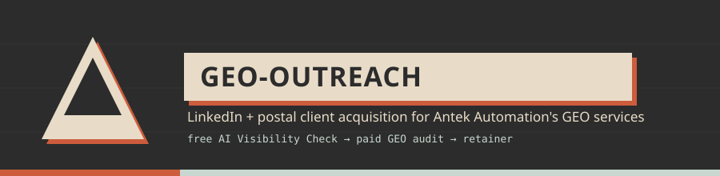

<p align="center">
  
</p>

# geo-outreach

LinkedIn and postal client acquisition for Antek Automation's GEO (Generative
Engine Optimisation) services. The lead magnet is a free AI Visibility Check.
Conversion path: free check → paid GEO audit → monthly retainer.

The system drafts, queues and tracks. It never sends on your behalf. All
LinkedIn sends are manual, and nothing posts to PostGrid without an explicit
send step.

## The funnel

```
Google Places (API or Apify) / CSV / Airtable
→ franchise + client exclusion (3 checkpoints: ingest, route, draft)
→ Companies House enrichment (UK) / web-owner scrape (US + fallback everywhere)
→ SQLite pipeline
→ mini visibility check (the opener finding) → CHANNEL ROUTER
   ├── person has a LinkedIn URL → 3-touch LinkedIn sequence (you copy + send)
   └── no LinkedIn person        → personalised letter to a director (PostGrid)
→ claim page (Cloudflare) → reply / claim → deliver the free AI Visibility Check
→ follow-up → paid GEO audit → retainer
```

Or run the whole thing staged, with mandatory scope questions and a mandatory
send confirmation, via `.claude/skills/full-prospect-pipeline/SKILL.md`.

## Setup

Requires Python 3.11+ and [uv](https://docs.astral.sh/uv/).

```bash
uv sync                       # install dependencies
cp .env.example .env          # then fill in your keys
uv run python -m src.db       # create data/pipeline.db (also auto-runs on any command)
```

WeasyPrint (PDF rendering) needs system libraries on some machines:
`libpango`, `libcairo`, `libgdk-pixbuf`, `libffi`. On Debian/Ubuntu:
`sudo apt-get install libpango-1.0-0 libpangocairo-1.0-0 libgdk-pixbuf-2.0-0 libffi-dev`.

Playwright (JS-heavy site scraping for owner enrichment) needs its browser
binary installed once: `uv run playwright install chromium`.

### Keys

See `.env.example` for the full annotated list. Summary:

| Key | Used for |
|---|---|
| `OPENROUTER_API_KEY` | all LLM calls + the 4 visibility flagships (ChatGPT, Claude, Gemini, Perplexity) + web-owner name extraction (gpt-4o-mini) |
| `SERPAPI_KEY` | Google AI Overview probe (5th engine) |
| `GOOGLE_PLACES_API_KEY` | official Places API (New) ingest — preferred over the Apify actor, no Apify credit |
| `APIFY_TOKEN` | fallback Places actor; LinkedIn enrichment |
| `COMPANIES_HOUSE_API_KEY` | UK directors, registration, SIC codes (fuzzy-matched, see below) |
| `POSTGRID_API_KEY`, `POSTGRID_TEMPLATE_UK`, `POSTGRID_TEMPLATE_US` | postal letters (current channel) |
| `STANNP_API_KEY` | postal letters (legacy, superseded by PostGrid) |
| `CLAIM_SITE_URL`, `CAL_LINK`, `CLOUDFLARE_API_TOKEN`, `CLOUDFLARE_ACCOUNT_ID` | claim pages + one-off audit pages, hosted on Cloudflare Pages |
| `ALLOW_SUNBIZ` | must be deliberately set to `1` — Sunbiz enrichment never runs by accident, low yield for the cost |
| `AIRTABLE_API_KEY`, `AIRTABLE_BASE_ID` | Airtable import |
| `CLAIM_BASE_URL` | legacy short-URL base (n8n-wired claim codes, see below) |

### Visibility check (hybrid, aligned with geo-slab)

The free AI Visibility Check queries four consumer flagships through one
OpenRouter key — `openai/gpt-5.2-chat`, `anthropic/claude-sonnet-5`,
`google/gemini-2.5-flash`, `perplexity/sonar` — plus Google AI Overview via
SerpAPI. The composite is the geo-slab 70/30 rubric (platform breadth + prompt
frequency). Model slugs live in `src/config.py CHECK_MODELS`. If every engine
errors, the check aborts rather than shipping a fake 0/100. Competitor names are
validated by `src/visibility/competitor_gate.py` so no directory, page heading,
or the firm's own name variant is ever printed as a rival.

`config.CHECK_COUNTRY` defaults to `UK`; pass `--country US` (or set it) to
target US buyer-intent queries. Google's own AI Overviews/AI Mode do not
require llms.txt or schema.org markup per their published guidance — those
signals matter for the other engines (ChatGPT, Perplexity, Claude), not Google
specifically. Keep that distinction in any client-facing copy.

### Enrichment: web-owner scrape first, always

Standing policy, enforced in `.claude/skills/full-prospect-pipeline/SKILL.md`:

1. **`ingest web-owner`** — free website scrape (About/Team page) + LLM name
   extraction (gpt-4o-mini via OpenRouter, server-side) + public contact email
   scrape. ~80% hit-rate on real small-business sites, ~£0. Always runs first,
   for every company without a named person.
2. **`ingest email-backfill`** — for companies that already have a name but no
   email (e.g. from an earlier `--no-email` pass). Same scrape-first logic,
   never touches the name/title, only fills email. Resumable across runs via
   an `email_backfill_attempts` table (so re-running never retries a
   permanently-failing company).
3. **Apollo / DBPR / Sunbiz** — only as an explicit, operator-opted-in fallback
   to fill a *remaining* gap once the free scrape has run. Never automatic,
   never the first pass. Sunbiz is additionally hard-gated behind
   `ALLOW_SUNBIZ=1`.
4. **Companies House (UK)** — `ingest ch` now does fuzzy name matching
   (token-sort ratio + postcode-district signal, `ch_match_confidence` 0-1),
   not exact-match-only. ≥0.8 auto-accepts and fetches directors; 0.5-0.8 goes
   to a review queue (`ingest ch --review`) rather than risking a
   wrong-director letter; <0.5 falls back to "The Owner".

US postal reliance on the web-scrape name (rather than a Companies-House
equivalent, which doesn't exist for the US) is lower-confidence — the pipeline
skill flags this explicitly rather than treating it as equal to UK.

### Company name cleaning

Raw Google Places listing titles routinely stack the real business name with
SEO taglines, franchise affiliations, and credential suffixes
(`"Alena Kolyadchik, LLC / English-Russian speaking Realtor(R) in Orlando"`).
`clean_display_name()` in `src/post/letter.py` strips all of that before a
name is ever shown to a recipient — letters, claim pages, CSVs. **Never write
`company["name"]` directly into anything recipient-facing.** Full spec and the
mandatory 5-step regeneration workflow (any change to the cleaner must
regenerate PDFs → claim pages → redeploy → CSVs → re-zip) are in `CLAUDE.md`.

Franchises never get a letter (checked at ingest, route, and draft — 3
checkpoints, deliberately redundant). Clients are excluded permanently via
`companies.status='client'`.

## Fastest path to first send

```bash
uv run cli ingest places --sector "solicitors" --town Winchester --max 50
uv run cli route                                     # linkedin vs post
uv run cli ingest web-owner --state UK --limit 20     # names + emails, free scrape
uv run cli ingest ch --status new --limit 50          # UK: directors + registration
uv run cli check mini --status new --limit 10         # the opener findings
uv run cli draft --batch --status checked --limit 10  # LinkedIn sequences
uv run cli post draft --limit 10                      # postal letters
uv run cli queue                                       # today's work list
```

For a brand-new industry/area combo, prefer `/pipeline` (or the staged skill
directly, `.claude/skills/full-prospect-pipeline/SKILL.md`) over hand-chaining
these — it adds the upfront scope questions and the mandatory send confirmation.

## Daily routine (about 30 minutes)

1. `uv run cli queue` — respond to replies first, always. Within the hour.
2. Send due touch 2s and 3s, log each: `uv run cli sent --touch-id N`.
3. Send up to 15 new connection notes from the drafted pool.
4. Log any accepts: `uv run cli accepted --person-id N`.
5. Deliver promised checks: `uv run cli check full --company-id N --yes` then
   `uv run cli delivered --company-id N`.

For the postal side: draft (`cli post draft`), then send via PostGrid
(`cli postgrid-send --limit N --campaign name --dry-run` first, then for real).
Nothing sends without that dry-run-then-confirm step.

## Weekly routine

```bash
uv run cli stats                       # funnel + metrics, split by channel
uv run cli stats weekly                # writes output/reports/weekly-YYYY-WW.md
uv run cli ingest places --sector "solicitors" --town Winchester --max 50
uv run cli check mini --status new     # overnight
uv run cli draft --batch               # in the morning
```

## Commands

```
ingest places|csv|airtable|ch|web-owner|email-backfill|apollo|dbpr|sunbiz
                                         prospecting + enrichment (web-owner first, always)
route                                   set channel (linkedin | post)
pitchability                            rank leads (geo-slab rubric) for the queue
person add                              manual person record
check mini|full|show                    visibility checks
draft [--person-id | --batch]           3-touch LinkedIn sequence
audit --touch-id                        pre-send message audit
opener --company-id --profile           three opener options from profile text
log-reply --person-id --text            classify + draft a response
sent / accepted / delivered             log pipeline actions
audit-proposed / audit-paid / retainer  log revenue events
followup / followup-nudge / closed      timing + close
queue                                   the daily work list
post draft|followup|approve|send        postal channel (letter PDFs; send is legacy Stannp)
postgrid-send [--dry-run] [--live]      current postal send path
claim code|import                       letter claim handling (legacy n8n webhook path)
stats [--channel] / stats weekly        reporting
```

Slash commands (in Claude Code): `/prospect`, `/check`, `/draft`, `/audit`,
`/opener`, `/reply`, `/today`, `/stats`, `/week`, `/pipeline` (new industry +
area, full staged run via `full-prospect-pipeline` — see below).

## Channel routing

`cli route` sets `companies.channel`:

- Any person on the company has a `linkedin_url` → `linkedin`.
- No LinkedIn person, and the company has been in the pipeline 7+ days (or
  `--force`) → `post`. The letter is addressed to a Companies House director
  (Ltd, UK) or the proprietor / "The Owner" (sole trader, or US where no
  Companies House equivalent exists).
- Franchise offices and `status='client'` companies are excluded before
  routing ever assigns a channel.

## Claim pages (Cloudflare)

`claim-site/build.py` generates static teaser + full-report pages per company
(`go.antekautomation.com/<slug>` and `/report/<slug>`), deployed to Cloudflare
Pages (`antek-claim` project). One-off ad-hoc AI visibility checks (not part
of the outreach pipeline) get their own path convention,
`go.antekautomation.com/audit/<slug>` — see the "Live-hosting a client report"
section in `geo-slab`'s `CLAUDE.md` for the exact deploy steps (same
Cloudflare project, different `dist/` subpath so the two never collide).

```bash
CAL_LINK=antek-automation/30min CLAIM_SITE_URL=https://go.antekautomation.com \
  uv run python claim-site/build.py --limit 2000
cd claim-site && cp -r functions dist/functions
npx wrangler pages deploy dist --project-name antek-claim --branch main
```

Mailing CSVs (`claim-site/mailing_csv.py`) always pass the business-name
column through `clean_display_name()` — this was a real bug once (raw name
leaking into a shipped CSV after the cleaner was fixed everywhere else),
now a permanent checklist item.

### Legacy claim-code webhook path

Some older letters still use a short URL (`CLAIM_BASE_URL/{code}`) redirected
and logged by an n8n + Contabo webhook rather than the Cloudflare claim pages
above. Expected payload:

```json
{ "claim_code": "XYZ123", "claimed_at": "2026-07-11T10:22:00Z",
  "user_agent": "...", "ip": "..." }
```

```bash
uv run cli claim import claims.csv     # or a single one: cli claim code XYZ123
```

A claim moves the company to `replied` and surfaces "deliver free check" in the
daily queue.

## Binary storage (PDFs, CSV bundles)

PDF/zip artefacts (letter batches, mailing bundles) are stored as **GitHub
releases** on this repo rather than Google Drive — the Drive connector
tokenises binaries badly. `gh release create` / `gh release upload --clobber`.

## Compliance

- All LinkedIn sends are manual. This system never automates sending.
- Prospect data is B2B, legitimate-interest basis. `source` and `source_date`
  are logged on every record.
- Google Places (official API preferred, Apify actor as fallback) and public
  web data only. LinkedIn scraping is off by default and not built into this
  project.
- Antek Automation is not a limited company. Nothing generated writes "Ltd".
- No bulk paid enrichment (Apollo/DBPR/Sunbiz) runs without an explicit,
  per-run operator opt-in — see "Enrichment" above.

## Layout

```
src/db.py            schema, migrations, helpers, status engine
src/config.py        model routing, caps, cadence, paths, country_geo()
src/llm.py           OpenRouter wrapper (llm.complete(task, ...))
src/franchises.py    franchise-brand detection (3-checkpoint exclusion)
src/ingest/          places (place_id dedup), csv, airtable, companies_house
                     (fuzzy match confidence), web_owner (scrape-first
                     enrichment + email-backfill), dbpr, sunbiz, apollo, router
src/visibility/      prompts, probes, score, report, competitor_gate,
                     ai_query, pitchability (check engine; gate + rubric from geo-slab)
src/messages/        generate, audit, replies, pipeline, queue, voice
src/post/            letter (clean_display_name, franchise checks),
                     postgrid_send, postgrid_html, stannp (legacy), claims
src/reports/         brand.py (Antek tokens), stats.py (funnel + weekly)
claim-site/          build.py (teaser + report pages), mailing_csv.py
.claude/skills/      antek-outreach-voice, full-prospect-pipeline
.claude/commands/    slash-command wrappers
```
